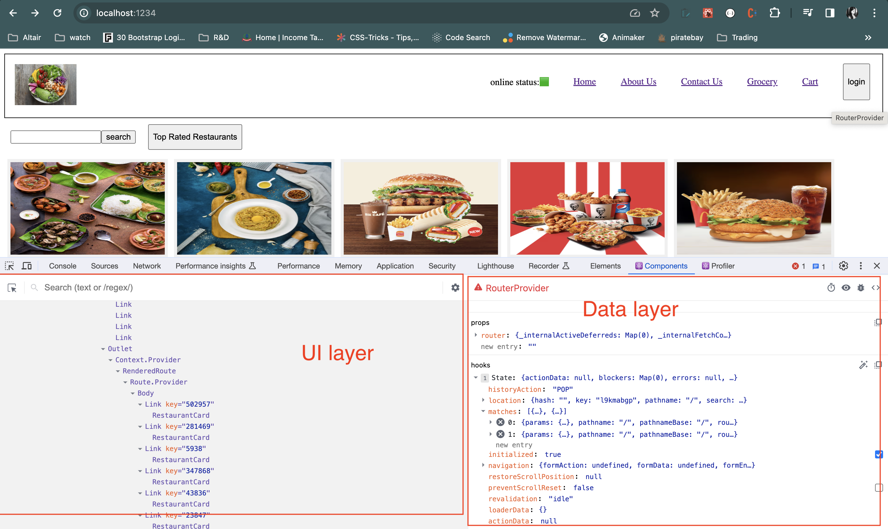

--> Higher order components:- it is a function that takes a component and returns a component

--> controlled and uncontrolled components:- 

components which don't have their own state and is controlled by parent's state is known as controlled components.

components which have their or state and is being modified by their own state is known as uncontrolled components.

--> stateless and statefull components :- 
stateless functional components also called functional components are javascript functions which accept props as arguments and return react elements to describe the UI
they do not manage any internal state or lifecycle methods

statefull class components are javascript classes that extend react.component and they also have inbuild state object and can define lifecycle methods
they manage their own internal state using this.state object and they can change their state by calling this.setState()
--> data layer[all the elements used], ui layer[all the usestates or datas used].

--> lifting the state up in react

--> useContext
    props drilling:- 

--> difference between useContext and redux

--> small and mid sized applications use useContext.

--> difference between virtual dom and shadow dom
