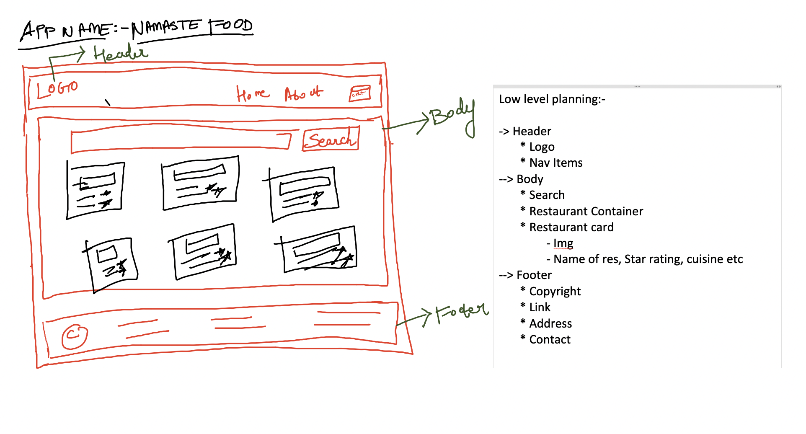
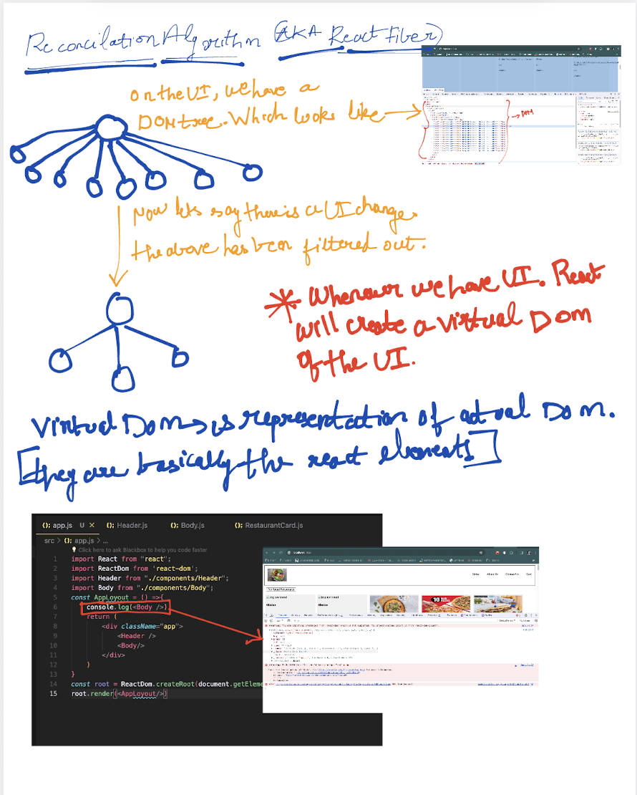
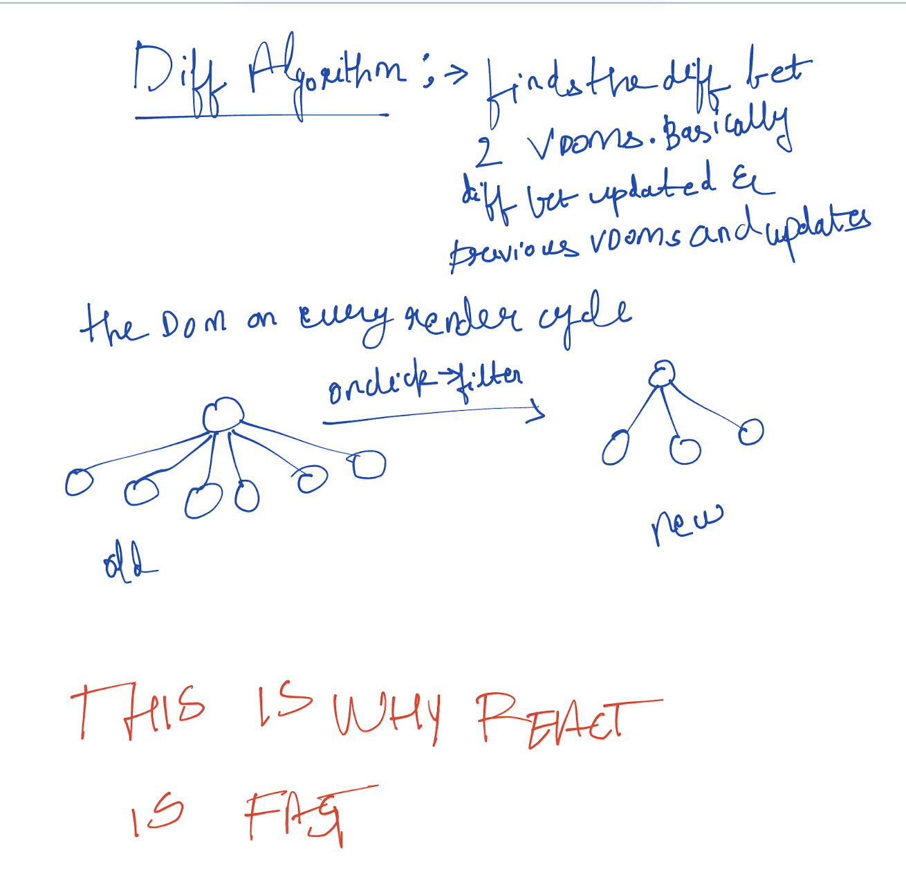
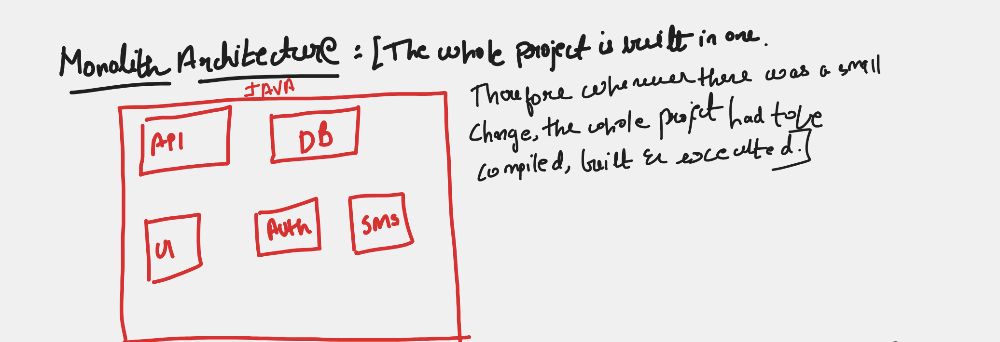
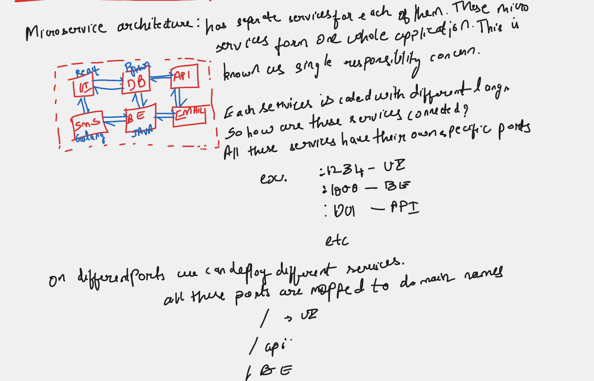
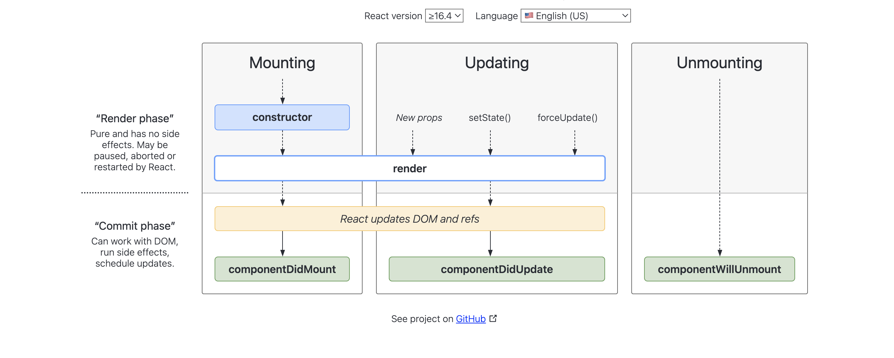

--> 

--> config driven ui:- based on the data that is coming from backend/api the ui is updated 

--> while doing .map giving key is very important because if you don't key then when a new data is coming the entire list gets rerendered instead of the particular data which is coming in. This is one of the great way of optimising

--> react is doing efficient dom manipulation therefore it makes data load fast 

--> useState :- whenever a state variable changes react rerenders the component

--> What is react doing behind the scenes to make the application fast.
A:- Reconcilation Algorithm (aka React Fibre)
, 

--> , 

-->useEffect()

--> if no dependency array => useEffect is called on every render.
useEffect(()=>{})
--> if dependency array is empty = [] => useEffect is called on initial render (just once).
useEffect(()=>{

},[])
--> if dependency array is [btnName] => useEffect is called everytime btnName is updated.
useEffect(()=>{

},[btnName])

--> we can have 2 types of routing in web applications:- 
1. client side routing - when we use <Link> all the components are already present we are not making any network call and when we switch pages the components get rendered.
2. server side routing - we have different pages like index.html, about.html, contact.html etc when we click on a tag "/about" , it reloads the whole page send the network call to about.html fetches the html and renders it on to the web page

--> react lifecycle:-

1. parent constructor
2. parent render 
3. child constructor
4. child render 
5. child mount
6. parent mount

--> when we have multiple children:-
1.parent constructor
2.parent render
3.firstchild constructor
4.firstchild render
5.secondchild constructor
6.secondchild render
7.firstchild mount
8.secondchild mount
9.parent mount

